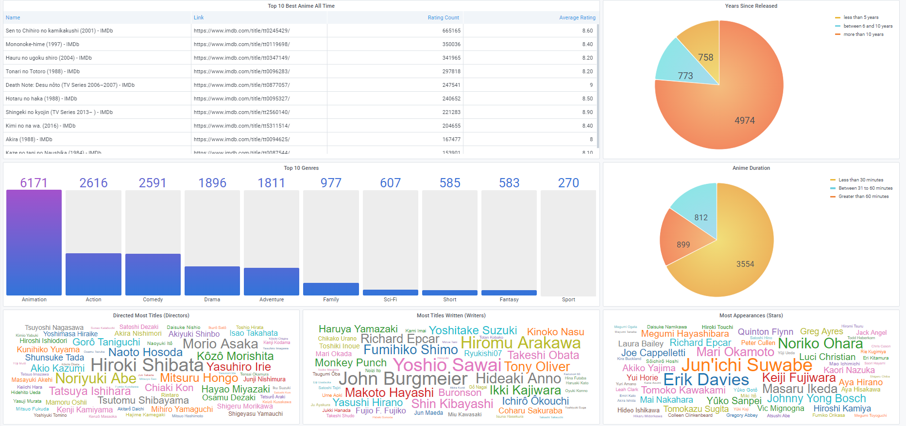
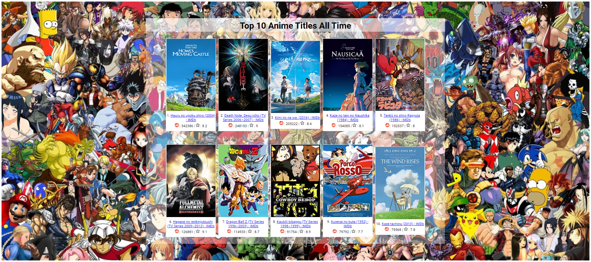
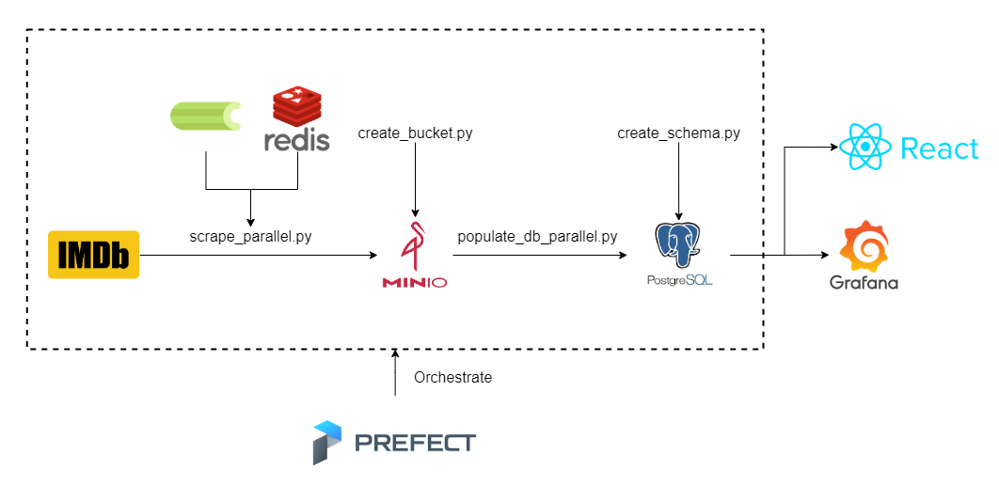
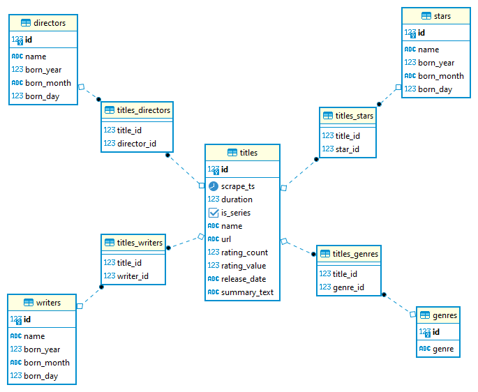

# IMDb Scraping

## Introduction
This repo performs web scraping on the IMDb website using `BeautifulSoup4`, particularly on Anime titles (who doesn't like Animes, duh!). Data of each of the Anime titles are uploaded to `MinIO` as JSON files, where each JSON file contains data of 5 titles. The `populate_db_parallel.py` script will read these JSON files and populate the `PostgreSQL` database with the [following schema](#database-schema). Finally, `Grafana` pulls the data from `PostgreSQL` for us to visualize the data.

## IMPORTANT
1. Intensive web scraping can cause heavy load on the IMDb servers. You can get blocked from accessing IMDb website if you intend to speed up the scraping jobs by creating more processes. The script currently uses 2 * number of CPUs (my total CPUs = 12) and it seems alright...
    - It would be a better idea to directly download the dataset provided by the IMDb team [here](https://datasets.imdbws.com/) and the documentation for this dataset is found [here](https://www.imdb.com/interfaces/)
2. These scripts work for the current IMDb Title page layout at this time of writing (18 April 2021). The IMDb team is working on updates to the Title page and it is highly likely that these scripts may not work after the update...

## Dashboard
An example dashboard that I decided to come up with. 



## React App
I thought that the `Top 10 Best Anime All Time` table was too ugly so I decided to develop a Grafana `Panel` plugin to replace it. From there I figured out I needed to learn `React` (also means I have to pickup `JavaScript`) to create the plugin. 

I learned Javascript then React for about a week, and the following frontend interface is the end result of my effort :). I also had to use `Node` and `Express` to correctly reflect the top 10 anime titles stored in Postgres. The entire backend is just a single `GET` request/response so no big deal about it. 

I still think the frontend interfact looks ugly, but looks good enough after spending only one week on learning the whole JS stack required to develop this. I attempted to turn it into a Grafana Panel plugin, but it requires me to understand `TypeScript` as well, which I think it requires deeper understanding of the whole JavaScript and TypeScript paradigm. So I will just leave it as it is for now...



### Starting the React App
- To start the frontend React server, do `npm start` in `PROJECT_ROOT/anime-react`
- To start the backend Nodejs server, do `node index.js` in `PROJECT_ROOT/anime-react`
> **__NOTE:__** Make sure you already have the web scraping data stored in Postgres before doing these two steps. If not there will be error since the backend can't actually pull the data from Postgres. Start from [here](#starting-docker-containers) to scrape the data from IMDb website. 

## High-Level Block Diagram
This section describes what components each script interacts with in the workflow.



## Database Schema
I decided to adopt a snowflake schema instead of star schema because of the many-to-many relationships between the tables (e.g. one title can have many writers, stars and genres) and I think I still couldn't get over the fact of the highly denormalized fact table if star schema is adopted instead. I researched a little bit and I found that composite tables are also being used in data warehouse, so I think this snowflake schema with only one composite table to each dimension table is a tradeoff I am willing to make. Feedbacks are welcome though :)



## Starting Docker containers
1. Create docker network
```
$ docker network create -d bridge imdb-scraping
```
2. Create and start `minio`, `postgres`, `rabbitmq`, `redis` and `grafana` containers
```
$ docker-compose up -d
```

## Execution sequence (after starting Docker containers)
1. Start celery workers
> celery -A tasks:app workers -l info -P gevent -c 24

    - Note that this command sets the value of concurrency to be 24

2. create_bucket.py
3. scrape_parallel.py
4. create_schema.py
5. populate_db_parallel.py

## Grafana Dashboard
Visit `Grafana` dashboard at `localhost:3000` and login using:
```
username: admin
password: password
```
